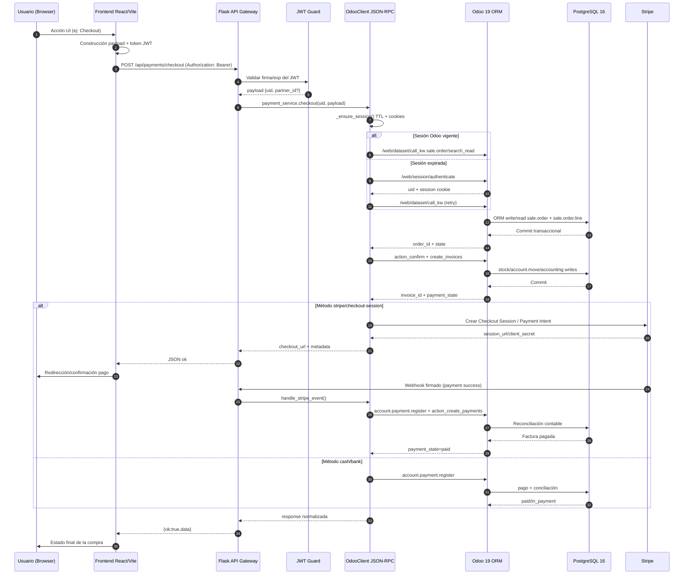

# Manual Técnico Integral de Catalogix

Este documento define el manual técnico de Catalogix con enfoque de arquitectura, operación, integración ERP y guía de implementación. Está orientado a equipos de ingeniería full-stack, arquitectos de solución, DevOps y responsables de continuidad operativa.

La redacción se basa en la estructura y el código del repositorio actual, y además incluye patrones de implementación recomendados cuando la arquitectura objetivo declara capacidades que todavía están en maduración (por ejemplo, uso explícito de Axios interceptors, Zustand persistente o Stripe Elements con PaymentIntent).

## Capítulo 1: Introducción, modelo de negocio y especificaciones generales

### 1.1 Filosofía de diseño de Catalogix

Catalogix resuelve una tensión técnica clásica: por un lado, se necesita una experiencia de usuario muy reactiva, con navegación rápida, formularios dinámicos y actualizaciones inmediatas; por otro lado, el sistema de verdad transaccional vive en un ERP empresarial con reglas de negocio complejas, altamente acopladas a sus modelos internos, sus workflows y su consistencia contable.

La decisión arquitectónica central es no exponer Odoo directamente al navegador, ni duplicar reglas de negocio críticas en el frontend. En su lugar, se introduce un middleware en Flask que actúa como frontera de seguridad, normalizador semántico y orquestador de procesos. Este gateway traduce las intenciones de negocio del cliente web en operaciones JSON-RPC sobre Odoo, de modo que:

- El frontend conserva agilidad y desacoplamiento visual.
- El backend aplica políticas de autenticación y control de acceso unificadas.
- Odoo mantiene la autoridad sobre inventario, pedidos, facturación, asientos y conciliación.

Esta separación evita dos anti-patrones frecuentes:

1. Reescribir lógica contable en el frontend o en microservicios paralelos, con alto riesgo de divergencia funcional.
2. Escribir directamente en PostgreSQL saltando el ORM de Odoo, con corrupción silenciosa de invariantes de negocio.

### 1.2 Ecosistema multi-vendedor

El modelo comercial de Catalogix está diseñado para marketplace distribuido: cada vendedor administra su catálogo como unidad independiente, pero sobre una plataforma común. Esta lógica se implementa con:

- Un modelo custom `catalog.vendor` que encapsula identidad de tienda, estado operativo y relación con `res.partner` y `res.users`.
- Relación de productos a catálogos (`catalog.catalog`) y catálogos a vendedor (`vendor_id`).
- Endpoints segmentados por dominio (`/api/vendor/*`, `/api/admin/*`, `/store/*`) con filtros de ownership.

El resultado funcional es que cada vendor opera su mini-PIM (Product Information Management), define inventario, promociones y cupones, y publica un escaparate con aislamiento de edición respecto a otros vendedores.

### 1.3 Matriz de roles y permisos de acceso

#### Clientes (Storefront)

El cliente final consume rutas públicas y autenticadas para:

- Explorar catálogos y productos (`/store/catalogs`, `/store/products`).
- Persistir carrito por partner en `sale.order` estado draft.
- Aplicar promociones y cupones.
- Completar checkout y seguimiento de pago/factura.

#### Vendedores (Vendor Dashboard)

El vendedor opera paneles especializados:

- Gestión de productos (`/api/vendor/products`).
- Inventario y movimientos.
- Gestión de cupones/promociones.
- Reportes y exportaciones.
- Configuración de perfil/tienda.

La autorización combina JWT en Flask y validación de ownership en consultas a Odoo, por ejemplo comprobando que el `catalog_id` del producto pertenece al `partner_id` del vendedor autenticado.

#### Administradores (Admin Dashboard)

El rol administrador gestiona:

- Auditoría global (`admin_audit`).
- Usuarios/vendedores.
- Catálogos, pedidos, pagos y reportes cross-tenant.
- Diagnóstico operacional.

En Odoo, la capa de permisos se refuerza con `ir.model.access.csv` y grupos (`group_vendor` para operaciones delimitadas de vendedor, `base.group_system` para administración completa).

## Capítulo 2: Arquitectura de integración y flujo de datos

### 2.1 Arquitectura de microservicios híbridos

Aunque Catalogix no fragmenta cada dominio en un microservicio independiente, sí adopta un patrón híbrido: SPA + API Gateway + ERP transaccional. Flask cumple funciones de reverse proxy semántico hacia Odoo:

- Recibe REST JSON desde frontend.
- Aplica autenticación JWT y enriquecimiento de contexto (`uid`, `partner_id`).
- Encapsula reintentos de sesión Odoo y control de errores.
- Expone contratos API estables para UI, aun cuando Odoo cambie detalles internos.

Esta capa desacopla la evolución del frontend del ciclo de vida del ERP y minimiza filtración de complejidad de Odoo al cliente.

### 2.2 Diagrama de flujo del ciclo de vida de la petición



### 2.3 Acceso directo a base de datos vs ORM RPC

No debe escribirse directamente en PostgreSQL con SQL ad-hoc para operaciones de negocio de Odoo. La razón no es solo “buenas prácticas”, sino integridad funcional del ERP:

- `sale.order` requiere triggers de workflow (`action_confirm`) para generar reservas y movimientos.
- `account.move` necesita posteo contable (`action_post`) y conciliación por wizard.
- Stock y picking se activan por métodos de modelo, no por insert directo.
- Reglas fiscales, diarios, impuestos y cuentas por defecto dependen de lógica Python de Odoo.

Un `UPDATE` directo sobre tablas puede dejar datos “aparentemente correctos” pero inconsistente con:

- Estados de documentos.
- Asientos relacionados.
- Campos calculados o cacheados.
- Auditoría y trazabilidad.

Por eso Catalogix usa `call_kw` y métodos de modelo, preservando ciclo de negocio nativo.

## Capítulo 3: Capa frontend (React 19 y Vite)

### 3.1 Estructura de directorios del proyecto cliente

Estructura relevante observada:

```text
frontend/src/
  components/
    payments/
    dashboard/
    reports/
    ui/
  hooks/
    useCurrency.js
    useCart.js
    useAuth.js
  layouts/
    PublicLayout.jsx
    VendorLayout.jsx
    AdminLayout.jsx
    CustomerLayout.jsx
  pages/
    store/
    vendor/
    admin/
    auth/
  router/
    index.jsx
    routes.jsx
    guards.jsx
  services/
    odoo/
      odooClient.js
      authService.js
      paymentService.js
      vendorProductService.js
  store/
    authStore.js
    cartStore.js
  utils/
    formatCurrency.js
    brandedExcel.js
```

### 3.2 Enrutamiento protegido (Router Guards)

El sistema actual implementa guards en `frontend/src/router/guards.jsx` con redirección por rol. Un ejemplo completo:

```jsx
import { Navigate, useLocation } from "react-router-dom";
import authStore from "../store/authStore";

export function PrivateRoute({ children, requiredRole }) {
  const location = useLocation();
  const isAuthenticated = authStore.isAuthenticated();
  const role = authStore.getRole();

  if (!isAuthenticated) {
    return <Navigate to="/login" state={{ from: location }} replace />;
  }

  const allowedRoles = Array.isArray(requiredRole)
    ? requiredRole.map((r) => String(r).toLowerCase())
    : requiredRole
      ? [String(requiredRole).toLowerCase()]
      : null;

  if (allowedRoles && !allowedRoles.includes(role)) {
    if (role === "admin") return <Navigate to="/admin/dashboard" replace />;
    if (role === "vendor") return <Navigate to="/vendor/dashboard" replace />;
    return <Navigate to="/home" replace />;
  }

  return children;
}

export function PublicRoute({ children }) {
  const isAuthenticated = authStore.isAuthenticated();
  const role = authStore.getRole();

  if (isAuthenticated) {
    if (role === "admin") return <Navigate to="/admin/dashboard" replace />;
    if (role === "vendor") return <Navigate to="/vendor/dashboard" replace />;
    return <Navigate to="/home" replace />;
  }

  return children;
}
```

Y un ejemplo del montaje de rutas con `VendorLayout`:

```jsx
import { Routes, Route, Navigate } from "react-router-dom";
import { PrivateRoute, PublicRoute } from "./guards";
import VendorLayout from "../layouts/VendorLayout";
import VendorDashboard from "../pages/vendor/VendorDashboard";
import VendorProducts from "../pages/vendor/Products";
import Login from "../pages/auth/Login";
import AuthLayout from "../layouts/AuthLayout";

export default function AppRoutes() {
  return (
    <Routes>
      <Route path="/" element={<Navigate to="/login" replace />} />

      <Route element={<PublicRoute><AuthLayout /></PublicRoute>}>
        <Route path="/login" element={<Login />} />
      </Route>

      <Route
        path="/vendor"
        element={
          <PrivateRoute requiredRole="vendor">
            <VendorLayout />
          </PrivateRoute>
        }
      >
        <Route index element={<Navigate to="/vendor/dashboard" replace />} />
        <Route path="dashboard" element={<VendorDashboard />} />
        <Route path="products" element={<VendorProducts />} />
      </Route>

      <Route path="*" element={<Navigate to="/home" replace />} />
    </Routes>
  );
}
```

### 3.3 Gestión del estado global con Zustand

El snapshot actual usa `authStore` manual y `CartContext`, pero el stack objetivo declara Zustand persistente. Implementación recomendada completa:

```js
import { create } from "zustand";
import { persist, createJSONStorage } from "zustand/middleware";

const TOKEN_KEY = "catalogix_token";
const REFRESH_KEY = "catalogix_refresh_token";

const clampQty = (qty) => {
  const value = Number(qty);
  if (!Number.isFinite(value) || value <= 0) return 1;
  return Math.floor(value);
};

export const useSessionCartStore = create(
  persist(
    (set, get) => ({
      token: "",
      refreshToken: "",
      user: null,
      isAuthenticated: false,
      currency: "DOP",
      items: [],

      setSession: ({ token, refreshToken, user }) => {
        const nextToken = String(token || "");
        const nextRefresh = String(refreshToken || "");
        set({
          token: nextToken,
          refreshToken: nextRefresh,
          user: user || null,
          isAuthenticated: Boolean(nextToken),
        });
      },

      clearSession: () => {
        set({
          token: "",
          refreshToken: "",
          user: null,
          isAuthenticated: false,
        });
      },

      setCurrency: (currencyCode) => {
        const code = String(currencyCode || "DOP").toUpperCase();
        set({ currency: code });
      },

      addItem: (product) => {
        if (!product || !product.id) return;
        set((state) => {
          const productId = Number(product.id);
          const price = Number(product.price || 0);
          const qty = clampQty(product.qty || 1);
          const existing = state.items.find((i) => Number(i.id) === productId);
          if (existing) {
            return {
              items: state.items.map((i) =>
                Number(i.id) === productId
                  ? { ...i, qty: clampQty(i.qty + qty), price }
                  : i
              ),
            };
          }
          return {
            items: [
              ...state.items,
              {
                id: productId,
                name: String(product.name || ""),
                qty,
                price,
                currency: String(product.currency || state.currency || "DOP").toUpperCase(),
                imageUrl: String(product.imageUrl || ""),
              },
            ],
          };
        });
      },

      updateQty: (productId, qty) => {
        const parsedId = Number(productId);
        const parsedQty = Number(qty);
        if (!Number.isFinite(parsedId)) return;
        if (!Number.isFinite(parsedQty) || parsedQty <= 0) {
          set((state) => ({
            items: state.items.filter((i) => Number(i.id) !== parsedId),
          }));
          return;
        }
        set((state) => ({
          items: state.items.map((i) =>
            Number(i.id) === parsedId ? { ...i, qty: clampQty(parsedQty) } : i
          ),
        }));
      },

      removeItem: (productId) => {
        const parsedId = Number(productId);
        if (!Number.isFinite(parsedId)) return;
        set((state) => ({
          items: state.items.filter((i) => Number(i.id) !== parsedId),
        }));
      },

      clearCart: () => set({ items: [] }),

      cartCount: () => get().items.reduce((acc, item) => acc + clampQty(item.qty), 0),

      cartSubtotal: () =>
        get().items.reduce((acc, item) => acc + Number(item.price || 0) * clampQty(item.qty), 0),
    }),
    {
      name: "catalogix_session_cart_store",
      storage: createJSONStorage(() => localStorage),
      partialize: (state) => ({
        token: state.token,
        refreshToken: state.refreshToken,
        user: state.user,
        isAuthenticated: state.isAuthenticated,
        currency: state.currency,
        items: state.items,
      }),
      onRehydrateStorage: () => (state) => {
        if (!state) return;
        if (state.token) localStorage.setItem(TOKEN_KEY, state.token);
        if (state.refreshToken) localStorage.setItem(REFRESH_KEY, state.refreshToken);
      },
    }
  )
);
```

### 3.4 Formularios reactivos y validación con Zod

Ejemplo completo de formulario de producto con `react-hook-form` y `zod`, incluyendo reglas de negocio:

```jsx
import React from "react";
import { useForm, Controller } from "react-hook-form";
import { z } from "zod";
import { zodResolver } from "@hookform/resolvers/zod";
import vendorProductService from "../../services/odoo/vendorProductService";

const currencyCode = z.string().trim().toUpperCase().regex(/^[A-Z]{3}$/, "Moneda inválida");

const productSchema = z.object({
  name: z.string().trim().min(2, "El nombre debe tener al menos 2 caracteres"),
  sku: z.string().trim().min(2, "SKU requerido"),
  description: z.string().trim().max(2000, "Descripción demasiado larga"),
  price: z.coerce.number().min(0, "Precio inválido"),
  cost: z.coerce.number().min(0, "Costo inválido"),
  stock: z.coerce.number().min(0, "Stock inválido"),
  minStock: z.coerce.number().min(0, "Mínimo inválido"),
  currency: currencyCode,
  category: z.string().trim().min(1, "Categoría requerida"),
  catalog: z.string().trim().min(1, "Catálogo requerido"),
  status: z.enum(["active", "inactive", "draft"]),
  taxable: z.boolean(),
  featured: z.boolean(),
  colors: z.array(z.string().trim().min(1)).max(25),
  sizes: z.array(z.string().trim().min(1)).max(25),
  imagesBase64: z.array(z.string().min(20, "Imagen inválida")).max(4, "Máximo 4 imágenes"),
}).superRefine((data, ctx) => {
  if (data.cost > data.price) {
    ctx.addIssue({
      code: z.ZodIssueCode.custom,
      path: ["cost"],
      message: "El costo no debe exceder el precio de venta",
    });
  }
});

export default function ProductFormWithZod({ initialData, onSaved }) {
  const {
    register,
    handleSubmit,
    control,
    formState: { errors, isSubmitting, isDirty },
    reset,
    watch,
  } = useForm({
    resolver: zodResolver(productSchema),
    defaultValues: initialData || {
      name: "",
      sku: "",
      description: "",
      price: 0,
      cost: 0,
      stock: 0,
      minStock: 5,
      currency: "DOP",
      category: "",
      catalog: "",
      status: "draft",
      taxable: true,
      featured: false,
      colors: [],
      sizes: [],
      imagesBase64: [],
    },
    mode: "onBlur",
  });

  const onSubmit = async (values) => {
    const payload = {
      ...values,
      images_base64: values.imagesBase64,
      min_stock: values.minStock,
    };

    try {
      const response = await vendorProductService.create(payload);
      if (onSaved) onSaved(response);
      reset(values);
    } catch (err) {
      throw new Error(err?.message || "No se pudo guardar el producto");
    }
  };

  const price = watch("price");
  const cost = watch("cost");
  const margin = price > 0 ? (((price - cost) / price) * 100).toFixed(2) : "0.00";

  return (
    <form onSubmit={handleSubmit(onSubmit)} noValidate>
      <label>
        Nombre
        <input type="text" {...register("name")} />
        {errors.name && <span>{errors.name.message}</span>}
      </label>

      <label>
        SKU
        <input type="text" {...register("sku")} />
        {errors.sku && <span>{errors.sku.message}</span>}
      </label>

      <label>
        Precio
        <input type="number" step="0.01" {...register("price")} />
        {errors.price && <span>{errors.price.message}</span>}
      </label>

      <label>
        Costo
        <input type="number" step="0.01" {...register("cost")} />
        {errors.cost && <span>{errors.cost.message}</span>}
      </label>

      <label>
        Moneda
        <input type="text" maxLength={3} {...register("currency")} />
        {errors.currency && <span>{errors.currency.message}</span>}
      </label>

      <Controller
        control={control}
        name="taxable"
        render={({ field }) => (
          <label>
            Aplicar ITBIS
            <input
              type="checkbox"
              checked={field.value}
              onChange={(e) => field.onChange(e.target.checked)}
            />
          </label>
        )}
      />

      <p>Margen estimado: {margin}%</p>

      <button type="submit" disabled={isSubmitting || !isDirty}>
        {isSubmitting ? "Guardando..." : "Guardar producto"}
      </button>
    </form>
  );
}
```

### 3.5 Componentes de visualización de datos avanzados

Implementación recomendada de tabla con `@tanstack/react-table` y paginación/ordenamiento server-side:

```jsx
import React, { useEffect, useMemo, useState } from "react";
import {
  useReactTable,
  getCoreRowModel,
  flexRender,
} from "@tanstack/react-table";
import vendorProductService from "../../services/odoo/vendorProductService";

export default function VendorProductsTable() {
  const [rows, setRows] = useState([]);
  const [total, setTotal] = useState(0);
  const [loading, setLoading] = useState(false);
  const [sorting, setSorting] = useState([]);
  const [pagination, setPagination] = useState({ pageIndex: 0, pageSize: 20 });

  const columns = useMemo(
    () => [
      { accessorKey: "id", header: "ID" },
      { accessorKey: "name", header: "Producto" },
      { accessorKey: "catalog", header: "Catálogo" },
      { accessorKey: "price", header: "Precio" },
      { accessorKey: "stock", header: "Stock" },
      { accessorKey: "status", header: "Estado" },
    ],
    []
  );

  useEffect(() => {
    const controller = new AbortController();
    const load = async () => {
      setLoading(true);
      try {
        const sort = sorting[0];
        const sortField = sort?.id || "id";
        const sortDir = sort?.desc ? "desc" : "asc";
        const offset = pagination.pageIndex * pagination.pageSize;

        const response = await vendorProductService.list({
          limit: pagination.pageSize,
          offset,
          sort: `${sortField}:${sortDir}`,
          signal: controller.signal,
        });

        setRows(Array.isArray(response?.items) ? response.items : response || []);
        setTotal(Number(response?.total || 0));
      } catch (err) {
        if (err?.name !== "AbortError") {
          setRows([]);
          setTotal(0);
        }
      } finally {
        setLoading(false);
      }
    };
    load();
    return () => controller.abort();
  }, [sorting, pagination]);

  const table = useReactTable({
    data: rows,
    columns,
    manualPagination: true,
    manualSorting: true,
    pageCount: Math.ceil(total / pagination.pageSize) || 1,
    state: { sorting, pagination },
    onSortingChange: setSorting,
    onPaginationChange: setPagination,
    getCoreRowModel: getCoreRowModel(),
  });

  return (
    <div>
      {loading && <p>Cargando...</p>}
      <table>
        <thead>
          {table.getHeaderGroups().map((hg) => (
            <tr key={hg.id}>
              {hg.headers.map((h) => (
                <th
                  key={h.id}
                  onClick={h.column.getToggleSortingHandler()}
                  style={{ cursor: "pointer" }}
                >
                  {flexRender(h.column.columnDef.header, h.getContext())}
                </th>
              ))}
            </tr>
          ))}
        </thead>
        <tbody>
          {table.getRowModel().rows.map((r) => (
            <tr key={r.id}>
              {r.getVisibleCells().map((c) => (
                <td key={c.id}>{flexRender(c.column.columnDef.cell, c.getContext())}</td>
              ))}
            </tr>
          ))}
        </tbody>
      </table>

      <div>
        <button onClick={() => table.previousPage()} disabled={!table.getCanPreviousPage()}>
          Anterior
        </button>
        <span>
          Página {pagination.pageIndex + 1} de {table.getPageCount()}
        </span>
        <button onClick={() => table.nextPage()} disabled={!table.getCanNextPage()}>
          Siguiente
        </button>
      </div>
    </div>
  );
}
```

Y ejemplo completo con `recharts` para tendencia financiera:

```jsx
import React from "react";
import {
  ResponsiveContainer,
  LineChart,
  Line,
  CartesianGrid,
  XAxis,
  YAxis,
  Tooltip,
  Legend,
} from "recharts";

const money = (value) =>
  new Intl.NumberFormat("es-DO", { style: "currency", currency: "DOP" }).format(Number(value || 0));

export default function RevenueTrendChart({ data }) {
  const safeData = Array.isArray(data) ? data : [];
  return (
    <div style={{ width: "100%", height: 320 }}>
      <ResponsiveContainer>
        <LineChart data={safeData} margin={{ top: 20, right: 20, bottom: 10, left: 10 }}>
          <CartesianGrid strokeDasharray="3 3" />
          <XAxis dataKey="period" />
          <YAxis tickFormatter={money} />
          <Tooltip formatter={(v) => money(v)} />
          <Legend />
          <Line
            type="monotone"
            dataKey="gross"
            name="Ventas brutas"
            stroke="#2563eb"
            strokeWidth={2}
            dot={false}
          />
          <Line
            type="monotone"
            dataKey="net"
            name="Ventas netas"
            stroke="#0891b2"
            strokeWidth={2}
            dot={false}
          />
        </LineChart>
      </ResponsiveContainer>
    </div>
  );
}
```

## Capítulo 4: Middleware y API Gateway (Flask)

### 4.1 Diseño y estructura del servidor Flask

La aplicación utiliza factoría `create_app` y carga de entorno con `python-dotenv` en `backend/app/config.py`. Puntos técnicos clave:

- `BASE_DIR` y `load_dotenv` apuntan explícitamente al `.env` de backend para evitar dependencias del CWD.
- Configuración tipada para JWT, Odoo, Stripe, Google SSO, SMTP, WhatsApp.
- Registro modular de blueprints por dominio (`auth`, `vendor_*`, `admin_*`, `payments`, `currencies`, `whatsapp`).
- `CORS` centralizado.
- Logging adaptado a Gunicorn y fallback a stdout.

### 4.2 Implementación exhaustiva del cliente JSON-RPC con Odoo 19

Código completo de `backend/app/odoo/client.py`:

```python
"""
Odoo JSON-RPC client — compatible con Odoo 19.
Reemplaza XML-RPC que fue deprecado en Odoo 19.
"""
import time
import requests
from flask import current_app


class OdooClient:
    def __init__(self):
        self._session = requests.Session()
        self._uid = None
        self._last_auth_ts = 0.0
        self._session_ttl = 20 * 60

    def _cfg(self):
        return {
            "url": current_app.config["ODOO_URL"],
            "db": current_app.config["ODOO_DB"],
            "user": current_app.config["ODOO_USER"],
            "password": current_app.config["ODOO_PASSWORD"],
        }

    def _rpc(self, endpoint: str, params: dict, session: requests.Session | None = None):
        cfg = self._cfg()
        payload = {
            "jsonrpc": "2.0",
            "method": "call",
            "id": 1,
            "params": params,
        }
        sess = session or self._session
        try:
            resp = sess.post(
                f"{cfg['url']}{endpoint}",
                json=payload,
                timeout=15,
                headers={"Content-Type": "application/json"},
            )
            data = resp.json()
        except requests.exceptions.ConnectionError:
            raise ConnectionError(f"Cannot connect to Odoo at {cfg['url']}")
        except requests.exceptions.Timeout:
            raise TimeoutError("Odoo request timed out")

        if "error" in data:
            msg = (
                data["error"].get("data", {}).get("message")
                or data["error"].get("message", "Odoo error")
            )
            raise RuntimeError(msg)

        return data.get("result")

    def authenticate(
        self,
        username: str | None = None,
        password: str | None = None,
        persist: bool = True,
        session: requests.Session | None = None,
    ) -> int:
        cfg = self._cfg()
        sess = session or (self._session if persist else requests.Session())
        try:
            result = self._rpc(
                "/web/session/authenticate",
                {
                    "db": cfg["db"],
                    "login": username or cfg["user"],
                    "password": password or cfg["password"],
                },
                session=sess,
            )
        except RuntimeError as exc:
            msg = str(exc)
            if "Access Denied" in msg or "Access denied" in msg:
                raise PermissionError("Odoo authentication failed") from exc
            raise
        uid = result.get("uid") if result else None
        if not uid:
            raise PermissionError("Odoo authentication failed")
        return uid

    def _ensure_session(self) -> tuple[requests.Session, int]:
        now = time.time()
        if self._uid and (now - self._last_auth_ts) < self._session_ttl:
            return self._session, self._uid

        self._session = requests.Session()
        self._uid = self.authenticate(session=self._session, persist=False)
        self._last_auth_ts = now
        return self._session, self._uid

    def call(self, model: str, method: str, args: list, kwargs: dict = None):
        cfg = self._cfg()

        def _call_with_session(session: requests.Session, uid: int):
            return self._rpc(
                "/web/dataset/call_kw",
                {
                    "model": model,
                    "method": method,
                    "args": args,
                    "kwargs": kwargs or {},
                    "db": cfg["db"],
                    "uid": uid,
                    "password": cfg["password"],
                },
                session=session,
            )

        session, uid = self._ensure_session()
        try:
            return _call_with_session(session, uid)
        except RuntimeError as exc:
            msg = str(exc)
            if "Session expired" in msg or "Access denied" in msg:
                self._uid = None
                session, uid = self._ensure_session()
                return _call_with_session(session, uid)
            raise

    def search_read(
        self,
        model: str,
        domain: list,
        fields: list,
        limit: int = 100,
        offset: int = 0,
        order: str = None,
    ) -> list:
        kwargs = {"fields": fields, "limit": limit, "offset": offset}
        if order:
            kwargs["order"] = order
        return self.call(model, "search_read", [domain], kwargs) or []

    def read(self, model: str, ids: list, fields: list) -> list:
        return self.call(model, "read", [ids], {"fields": fields}) or []

    def search(self, model: str, domain: list) -> list:
        return self.call(model, "search", [domain]) or []

    def create(self, model: str, values: dict) -> int:
        return self.call(model, "create", [values])

    def write(self, model: str, ids: list, values: dict) -> bool:
        return self.call(model, "write", [ids, values])

    def unlink(self, model: str, ids: list) -> bool:
        return self.call(model, "unlink", [ids])

    def search_count(self, model: str, domain: list) -> int:
        return self.call(model, "search_count", [domain]) or 0


odoo = OdooClient()
```

Detalles críticos de operación:

- Autenticación: `POST /web/session/authenticate` devuelve `uid` y cookie de sesión.
- Persistencia de sesión: `requests.Session` conserva cookies automáticamente.
- TTL: `_ensure_session` evita reautenticar por cada llamada.
- Recuperación: si Odoo responde `Session expired` o `Access denied`, invalida `_uid` y reintenta una vez.

### 4.3 Rutas y controladores

Ejemplos reales:

- Auth: `backend/app/router/auth.py`.
- Vendor products: `backend/app/router/vendor_products.py`.
- Vendor profile: `backend/app/router/vendor_profile.py`.
- Payments + webhook: `backend/app/router/payments.py`.

Ejemplo de endpoint de perfil de vendedor:

```python
from flask import Blueprint, request
from flask.views import MethodView
from ..middleware.auth_guard import jwt_required
from ..odoo.vendor_profile import get_vendor_profile, update_vendor_profile
from ..utils.response import error, success

bp = Blueprint("vendor_profile", __name__)


class VendorProfileAPI(MethodView):
    decorators = [jwt_required]

    def get(self):
        payload = getattr(request, "jwt_payload", None) or {}
        uid = payload.get("uid")
        if not uid:
            return error("Missing or invalid token", 401)
        try:
            return success(get_vendor_profile(int(uid)))
        except LookupError as exc:
            return error(str(exc), 404)
        except Exception as exc:
            return error(str(exc), 500)

    def patch(self):
        payload = getattr(request, "jwt_payload", None) or {}
        uid = payload.get("uid")
        if not uid:
            return error("Missing or invalid token", 401)
        data = request.get_json() or {}
        try:
            return success(update_vendor_profile(int(uid), data))
        except LookupError as exc:
            return error(str(exc), 404)
        except Exception as exc:
            return error(str(exc), 500)

    def put(self):
        return self.patch()


bp.add_url_rule("", view_func=VendorProfileAPI.as_view("vendor_profile"))
```

### 4.4 Autenticación híbrida (JWT + Google SSO)

Flujo JWT:

- Login contra Odoo.
- Emisión de access token (`exp` en horas) y refresh token (`exp` en días).
- Decorador `jwt_required` valida firma, expiración y presencia de `uid`.

Flujo Google SSO:

- Frontend envía `credential` (ID token de Google Identity Services).
- Backend valida firma y claims con `google-auth`.
- Si usuario no existe, lo aprovisiona en Odoo.
- Emite JWT local para sesión del portal.

Función de verificación Google (real):

```python
from google.auth.transport import requests as google_requests
from google.oauth2 import id_token as google_id_token


def verify_google_id_token(*, credential: str, client_id: str) -> dict:
    if not client_id:
        raise ValueError("GOOGLE_CLIENT_ID is not configured")
    if not credential:
        raise ValueError("Missing Google credential")

    payload = google_id_token.verify_oauth2_token(
        credential,
        google_requests.Request(),
        client_id,
    )
    return dict(payload or {})
```

## Capítulo 5: Core ERP y persistencia (Odoo 19)

### 5.1 Modelo personalizado `catalog.vendor`

Campos clave implementados en `backend/odoo_module/models/vendor.py`:

- `store_name` (`Char`, requerido).
- `status` (`Selection`: `pending`, `active`, `suspended`).
- `partner_id` (`Many2one` a `res.partner`, requerido y único por SQL constraint).
- `user_id` (`Many2one` a `res.users`).

Consulta y creación desde Flask vía RPC (`backend/app/odoo/vendor_profile.py`):

```python
from .client import odoo
from .users import UserService, get_user_by_id

VENDOR_FIELDS = [
    "id",
    "store_name",
    "status",
    "email",
    "phone",
    "partner_id",
    "user_id",
]


def _get_vendor_record(uid: int) -> dict | None:
    vendor_rows = odoo.search_read(
        "catalog.vendor",
        [["user_id", "=", uid]],
        VENDOR_FIELDS,
        limit=1,
    )
    if vendor_rows:
        return vendor_rows[0]

    partner_id = UserService.resolve_partner_id(uid)
    if not partner_id:
        return None

    vendor_rows = odoo.search_read(
        "catalog.vendor",
        [["partner_id", "=", partner_id]],
        VENDOR_FIELDS,
        limit=1,
    )
    return vendor_rows[0] if vendor_rows else None


def get_vendor_profile(uid: int) -> dict:
    user = get_user_by_id(uid)
    vendor = _get_vendor_record(uid)
    return {"user": user, "vendor": vendor}


def update_vendor_profile(uid: int, payload: dict) -> dict:
    user = get_user_by_id(uid)
    vendor = _get_vendor_record(uid)

    store_name = payload.get("store_name") or payload.get("storeName")
    email = payload.get("email")
    phone = payload.get("phone")

    values = {}
    if store_name is not None:
        values["store_name"] = str(store_name).strip()
    if email is not None:
        values["email"] = str(email).strip()
    if phone is not None:
        values["phone"] = str(phone).strip()

    if values:
        if not vendor:
            partner_id = UserService.resolve_partner_id(uid)
            if not partner_id:
                raise LookupError("Vendor partner not found")
            vendor_id = odoo.create(
                "catalog.vendor",
                {
                    "partner_id": partner_id,
                    "user_id": uid,
                    "store_name": values.get("store_name") or user.get("name") or "Vendedor",
                    "status": "pending",
                },
            )
            if email or phone:
                odoo.write("catalog.vendor", [vendor_id], values)
        else:
            odoo.write("catalog.vendor", [vendor["id"]], values)

    return get_vendor_profile(uid)
```

### 5.2 Catálogo de vendedores y aislamiento de productos

El aislamiento se logra por composición:

- Cada `product.template` tiene `catalog_id`.
- Cada `catalog.catalog` tiene `vendor_id` (`res.partner`).
- `VendorProductService` lista por `catalog_id in vendor_catalog_ids`.
- En detalle/edición, se valida ownership comparando vendor del catálogo con partner autenticado.

En `backend/odoo_module/models/product.py`, al crear producto sin catálogo explícito, se intenta autovincular al catálogo del vendedor conectado, o crear catálogo por defecto.

### 5.3 Módulo de monedas y conversión en tiempo real

`backend/app/odoo/currencies.py` implementa:

- Normalización: `"RD$"` se transforma a `"DOP"`.
- Cache local en memoria con TTL de 10 minutos (`_CACHE_TTL_SECONDS = 10 * 60`).
- Refresco por `_refresh_cache()` leyendo `res.currency`.
- Resolución robusta de ID (`resolve_currency_id`) con fallback a búsqueda puntual en Odoo.

Este diseño minimiza llamadas repetitivas para dropdowns de moneda, pero preserva coherencia porque la invalidez de cache queda acotada a 10 minutos.

### 5.4 Utilidades de manejo de moneda

`backend/app/utils/money.py` usa `Decimal` y `ROUND_HALF_UP`:

```python
from __future__ import annotations

from decimal import Decimal, ROUND_HALF_UP

from ..odoo.currencies import get_currency, normalize_currency_code


def currency_decimals(currency: str) -> int:
    try:
        code = normalize_currency_code(currency)
    except ValueError:
        return 2
    meta = get_currency(code) or {}
    try:
        return int(meta.get("decimals", 2))
    except Exception:
        return 2


def to_minor_units(value: float | str | Decimal, currency: str) -> int:
    decimals = currency_decimals(currency)
    amount = Decimal(str(value))
    factor = Decimal(10) ** Decimal(decimals)
    return int((amount * factor).quantize(Decimal("1"), rounding=ROUND_HALF_UP))
```

Esto evita errores de redondeo binario flotante típicos de `float` cuando se convierte a centavos para Stripe.

### 5.5 Ciclo de vida de órdenes y facturación

Flujo operacional en `PaymentService`:

1. Construcción/actualización de `sale.order` y líneas.
2. Confirmación (`action_confirm`) si está en draft/sent.
3. Validación de pickings y decremento de stock de catálogo.
4. Generación de factura por wizard `sale.advance.payment.inv`.
5. Posteo/registro de pago con `account.payment.register`.
6. Conciliación y actualización de `payment_state`.

Esto asegura que pedido, inventario y contabilidad evolucionen sincronizados.

## Capítulo 6: Integración de APIs externas y procesamiento de transacciones

### 6.1 Pasarela Stripe (flujo completo)

#### Flujo implementado actualmente

La base actual usa `Checkout Session` en `backend/app/stripe/service.py` y webhooks en `backend/app/router/payments.py`:

- `payment_service.checkout` crea orden/factura y luego genera sesión Stripe.
- El cliente recibe `checkout_url` y redirige.
- Stripe notifica webhook firmado.
- `handle_stripe_event` registra pago en Odoo vía wizard de pago.

#### Flujo objetivo con Stripe Elements + PaymentIntent

Si se requiere pasar a `PaymentIntent` + Elements en frontend, el flujo recomendado es:

1. Frontend monta `<PaymentElement>` o `<CardElement>`.
2. Frontend solicita `/api/payments/create-payment-intent`.
3. Backend calcula monto en minor units con `to_minor_units`.
4. Backend crea PaymentIntent con metadata (`odoo_order_id`, `odoo_invoice_id`).
5. Frontend confirma pago con `stripe.confirmPayment(...)`.
6. Webhook `payment_intent.succeeded` marca factura como pagada en Odoo.

Ejemplo backend de creación de PaymentIntent:

```python
from flask import Blueprint, request
from ..middleware.auth_guard import jwt_required
from ..utils.response import success, error
from ..utils.money import to_minor_units
import stripe
from flask import current_app

bp = Blueprint("payment_intent", __name__)


@bp.post("/create-payment-intent")
@jwt_required
def create_payment_intent():
    data = request.get_json() or {}
    try:
        amount = float(data.get("amount"))
        currency = str(data.get("currency") or "DOP").upper()
        order_id = int(data.get("order_id"))
        invoice_id = int(data.get("invoice_id"))
    except Exception:
        return error("Payload inválido", 400)

    stripe.api_key = current_app.config["STRIPE_SECRET_KEY"]
    minor = to_minor_units(amount, currency)
    if minor <= 0:
        return error("Monto inválido", 400)

    try:
        intent = stripe.PaymentIntent.create(
            amount=minor,
            currency=currency.lower(),
            automatic_payment_methods={"enabled": True},
            metadata={
                "odoo_order_id": str(order_id),
                "odoo_invoice_id": str(invoice_id),
            },
        )
        return success({"client_secret": intent.client_secret, "id": intent.id})
    except Exception as exc:
        return error(str(exc), 500)
```

### 6.2 Notificaciones omni-canal (WhatsApp Business API / Meta Cloud API)

Catalogix incluye `backend/app/whatsapp/service.py`, `notifiers.py` y `webhook.py`.

Flujo:

1. Se confirma pago/pedido.
2. Notificador obtiene partner y teléfono.
3. Se envía plantilla o texto usando Graph API.
4. Meta devuelve `message_id`.
5. Webhook de estados (`sent`, `delivered`, `read`, `failed`) se procesa para trazabilidad.

Incluye validación de firma `X-Hub-Signature-256` con HMAC SHA-256 cuando `WHATSAPP_APP_SECRET` está configurado.

## Capítulo 7: Infraestructura, despliegue y operaciones (DevOps)

### 7.1 Orquestación multi-contenedor con Docker

`docker-compose.yml` define cuatro servicios principales:

- `db` (`postgres:16`) con volumen `postgres_data`.
- `odoo` (`odoo:19.0`) con volúmenes `odoo_data`, addon mount y `odoo.conf`.
- `flask` (build local) expuesto en `5000`, conectado a `odoo` interno.
- `frontend` (build React + Nginx) expuesto en `5173:80`.

Detalles de diseño:

- Red bridge dedicada `catalogix`.
- Healthcheck de Postgres (`pg_isready`) para ordenar arranque.
- `depends_on` entre capas.
- Variables sensibles externalizadas por `env_file` backend.

### 7.2 Proceso de inicialización inicial

Secuencia recomendada de bootstrap:

1. Levantar stack con `docker compose up -d`.
2. Entrar a Odoo en `:8069`.
3. Crear/seleccionar DB `catalogix`.
4. Instalar módulo custom (`odoo_module`).
5. Configurar usuario admin y parámetros contables base.
6. Validar endpoints Flask y login frontend.

### 7.3 Configuración automatizada de contabilidad

`backend/scripts/setup_odoo_accounting.py` automatiza:

- Carga de plan de cuentas genérico (cuando disponible).
- Creación de cuentas críticas (`asset_receivable`, `liability_payable`, `income`, `expense`, `asset_cash`).
- Asignación de cuentas a partners y plantillas de producto.
- Configuración de journals de ventas, banco y caja.

Este script reduce errores manuales recurrentes que bloquean facturación y conciliación durante pruebas de pago.

## Capítulo 8: Guía de solución de errores y diagnóstico

### 8.1 Fallos críticos de comunicación JSON-RPC

| Síntoma | Causa probable | Detección | Solución |
|---|---|---|---|
| `Cannot connect to Odoo` | Odoo caído, URL incorrecta, red Docker | Logs Flask + healthcheck Odoo | Verificar `ODOO_URL`, estado contenedor y DNS de red |
| `Odoo request timed out` | Query lenta o bloqueo transaccional | Timeout 15s en `_rpc` | Revisar carga Odoo, índices y tamaño de lotes |
| `Session expired` | Cookie de sesión inválida o vencida | Excepción RuntimeError en `call` | `_ensure_session` + reautenticación automática |
| `Access denied` en `call_kw` | Usuario sin permisos o sesión inconsistente | Mensaje de error Odoo | Revisar grupos `res.users` y reglas de acceso |
| `Invalid token` (Flask) | JWT expirado/manipulado | `jwt_required` retorna 401 | Renovar refresh token o re-login |

### 8.2 Desajustes en tipo de cambio e impuestos

Diagnóstico sugerido:

1. Confirmar moneda de factura en `account.move.currency_id`.
2. Verificar normalización (`RD$ -> DOP`) en `currencies.py`.
3. Validar decimales definidos en `res.currency.decimal_places`.
4. Comparar monto enviado a Stripe (`to_minor_units`) vs monto de Odoo.
5. Revisar si el descuento/cupón se aplicó antes de calcular ITBIS.

Regla operativa: nunca enviar a Stripe un `float` sin convertir mediante `Decimal` y redondeo explícito.

### 8.3 Auditoría de seguridad e invalidación de sesiones

Controles recomendados:

- Rotar `JWT_SECRET` por entorno y con cadencia definida.
- Reducir `JWT_EXPIRY_HOURS` en producción (ej. 1-4h) y usar refresh controlado.
- Invalidar sesiones comprometidas eliminando refresh tokens en cliente y aplicando lista de revocación server-side si se requiere hard revoke.
- Auditar eventos críticos con `log_event` (`LOGIN_FAILED`, `CHECKOUT_BLOCKED`, `STRIPE_WEBHOOK_INVALID`).
- Restringir permisos de cuentas técnicas de Odoo usadas por middleware.

---

## Anexo A: Ejemplo de cliente API frontend con token y refresh

Código real de `frontend/src/services/odoo/odooClient.js` (equivalente conceptual de interceptor):

```js
import authStore from "../../store/authStore";

const BASE_URL = import.meta.env.VITE_API_URL || "http://localhost:5000";
const TOKEN_KEY = "catalogix_token";
const REFRESH_KEY = "catalogix_refresh_token";

let refreshPromise = null;

async function refreshAccessToken() {
  if (refreshPromise) return refreshPromise;
  const refreshToken = localStorage.getItem(REFRESH_KEY);
  if (!refreshToken) throw new Error("No refresh token");

  refreshPromise = (async () => {
    const res = await fetch(`${BASE_URL}/api/auth/refresh`, {
      method: "POST",
      headers: { "Content-Type": "application/json" },
      body: JSON.stringify({ refresh_token: refreshToken }),
    });
    const data = await res.json();
    if (!res.ok || !data?.ok) throw new Error(data?.error || "Refresh failed");
    const nextToken = data.data?.token;
    const nextRefresh = data.data?.refresh_token;
    if (nextToken) localStorage.setItem(TOKEN_KEY, nextToken);
    if (nextRefresh) localStorage.setItem(REFRESH_KEY, nextRefresh);
    return nextToken;
  })();

  try {
    return await refreshPromise;
  } finally {
    refreshPromise = null;
  }
}

async function request(method, endpoint, body = null, allowRetry = true) {
  const token = localStorage.getItem(TOKEN_KEY);
  const headers = { "Content-Type": "application/json" };
  if (token) headers.Authorization = `Bearer ${token}`;

  const options = { method, headers };
  if (body) options.body = JSON.stringify(body);

  const res = await fetch(`${BASE_URL}${endpoint}`, options);
  const data = await res.json();

  if (!res.ok) {
    if (res.status === 401 && token && !endpoint.startsWith("/api/auth/") && allowRetry) {
      try {
        await refreshAccessToken();
        return await request(method, endpoint, body, false);
      } catch {
        authStore.clearSession();
        window.location.assign("/login");
      }
    }
    throw new Error(data?.error || "Error de red");
  }

  if (!data?.ok) throw new Error(data?.error || "Respuesta inválida");
  return data.data;
}

export const api = {
  get: (endpoint) => request("GET", endpoint),
  post: (endpoint, body) => request("POST", endpoint, body),
  put: (endpoint, body) => request("PUT", endpoint, body),
  patch: (endpoint, body) => request("PATCH", endpoint, body),
  delete: (endpoint) => request("DELETE", endpoint),
};
```

## Anexo B: Consideraciones de evolución técnica

1. Migrar definitivamente `authStore` + `CartContext` a Zustand persistente para unificar flujo de estado.
2. Integrar `Stripe Elements + PaymentIntent` si se requiere captura en sitio en lugar de redirección Checkout Session.
3. Consolidar tabla/reportes con TanStack/Recharts para consistencia de dashboard.
4. Añadir pruebas de contrato JSON-RPC para detectar cambios de versión Odoo temprano.
